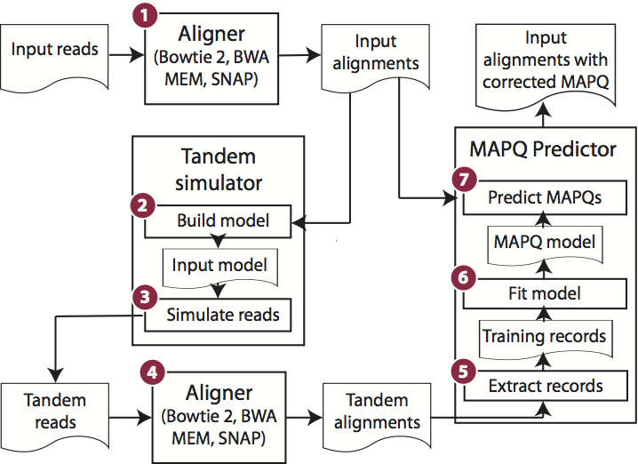

Qtip
====

[](https://travis-ci.org/BenLangmead/qtip)

 * [Background](#background)
 * [Dependencies](#dependencies)
 * [Using Qtip](#using-qtip)
 * [Building Qtip](#building-qtip)
 * [Testing Qtip](#testing-qtip)
 * [Running Qtip](#running-qtip)
 * [Qtip architecture](#qtip-architecture)

### Background

Read alignment is the first step in most sequencing data analyses. It is also a source of errors and interpretability problems. Repetitive genomes, algorithmic shortcuts, and genetic variation impede the aligner's ability to find a read's true point of origin. Aligners therefore report a mapping quality: the probability the reported point of origin for a read is incorrect.

Qtip is an accurate, aligner-agnostic tool for predicting mapping qualities that works by simulating a set of _tandem_ reads, similar to the input reads in important ways, but for which the true point of origin is known. Alignments of tandem reads are used to build a model for predicting mapping quality, which is then applied to the input-read alignments.
The model is automatically tailored to the alignment scenario at hand, allowing it to make accurate mapping-quality predictions across a range of read lengths, alignment parameters, genomes, and read aligners.

### Dependencies

* Python 2.7 or later
* Numpy
* [Scikit-learn](http://scikit-learn.org/)
* [Pandas](http://pandas.pydata.org)

### Building Qtip

If Qtip was cloned/extracted to a directory `$QTIP_HOME`, then:

    make -C $QTIP_HOME/src

### Using Qtip

Qtip runs alongside an existing aligner, though the aligner requires modifications for Qtip to obtain the feature data it needs to make predictions.  We have already made these modifications for the popular Bowtie 2, BWA-MEM and SNAP tools.  See the `software` subdirectory for details.

To run `qtip`, specify input reads, aligner, aligner arguments, genome index, and genome FASTA file.

```
usage: qtip [-h] --ref path [path ...] [--U path [path ...]]
            [--m1 path [path ...]] [--m2 path [path ...]] [--index path]
            [--seed int] [--max-allowed-fraglen int] [--input-model-size int]
            [--sim-unp-min int] [--sim-conc-min int] [--sim-disc-min int]
            [--sim-bad-end-min int] [--sim-function linear|sqrt]
            [--sim-factor fraction] [--wiggle int] [--bt2-exe path]
            [--bwa-exe path] [--snap-exe path] [--aligner name]
            [--write-orig-mapq] [--write-precise-mapq] [--orig-mapq-flag XX:X]
            [--precise-mapq-flag XX:X] [--keep-ztz] [--model-family family]
            [--num-trees int,int,...] [--max-features float,float,...]
            [--max-leaf-nodes int,int,...] [--learning-rate float,float,...]
            [--optimization-tolerance fraction] [--reweight-ratio float]
            [--reweight-mapq] [--reweight-mapq-offset float] [--collapse]
            [--max-rows int] [--no-oob] [--skip-rewrite] [--profile-memory]
            [--predict-for-training] [--try-include-mapq]
            [--subsampling-series floats] [--trials int] [--assess-accuracy]
            [--assess-limit int] [--temp-directory path]
            [--output-directory path] [--vanilla-output path]
            [--keep-intermediates] [--profile] [--verbose] [--version]

Align a collection of input reads, simulate a tandemdataset, align the tandem
dataset, and emit both theinput read alignments and the training data derived
fromthe tandem read alignments.

optional arguments:
  -h, --help            show this help message and exit
  --ref path [path ...]
                        FASTA file, or many FASTAs separated by spaces,
                        containing reference genome sequences (default: None)
  --U path [path ...]   Unpaired read FASTQ file name, or many FASTQ file
                        names separated by spaces (default: None)
  --m1 path [path ...]  Mate 1 FASTQ file name, or many FASTQ file names
                        separated by spaces; must be specified in same order
                        as --m2 (default: None)
  --m2 path [path ...]  Mate 2 FASTQ file name, or many FASTQ file names
                        separated by spaces; must be specified in same order
                        as --m1 (default: None)
  --index path          Index file to use; specify the appropriate prefix,
                        e.g. Bowtie 2 index file name without the .X.bt2
                        suffix. (default: None)
  --seed int            Integer to initialize pseudo-random generator
                        (default: 99099)
  --max-allowed-fraglen int
                        When simulating fragments, longer fragments are
                        truncated to this length (default: 100000)
  --input-model-size int
                        Maximum # templates to keep when building an input
                        model. There are 4 separate models for each alignment
                        category and this governs the maximum for all 4.
                        (default: 30000)
  --sim-unp-min int     If predictions for unpaired reads are needed, simulate
                        at least this # of unpaired reads. (default: 30000)
  --sim-conc-min int    If predictions for concordantly aligned reads are
                        needed, simulate at least this # of concordant pairs.
                        (default: 30000)
  --sim-disc-min int    If predictions for discordantly aligned reads are
                        needed, simulate at least this # of discordant pairs.
                        (default: 10000)
  --sim-bad-end-min int
                        If predictions for ends with an unaligned mate are
                        needed, simulate at least this # of pairs with a bad
                        end. (default: 10000)
  --sim-function linear|sqrt
                        Function giving # of tandem reads to simulate in a
                        category; parameter is the number of input reads. See
                        also: --sim-factor. (default: sqrt)
  --sim-factor fraction
                        This is multiplied with X (if --sim-function=linear)
                        or sqrt(X) (if --sim-function=sqrt) to calculate
                        number of tandem reads to simulate in a given
                        category, where X is # of input reads in that
                        category. (default: 45.0)
  --wiggle int          Wiggle room to allow in starting position when
                        determining whether alignment is correct (default: 30)
  --bt2-exe path        Path to Bowtie 2 aligner exe, "bowtie2" (default:
                        None)
  --bwa-exe path        Path to BWA-MEM aligner exe, "bwa" (default: None)
  --snap-exe path       Path to SNAP aligner exe, "snap-aligner" (default:
                        None)
  --aligner name        Which aligner to use: bowtie2 | bwa-mem | snap
                        (default: bowtie2)
  --write-orig-mapq     Write original MAPQ as an extra field in output SAM
                        (default: False)
  --write-precise-mapq  Write a more precise MAPQ prediction as an extra field
                        in output SAM (default: False)
  --orig-mapq-flag XX:X
                        If --write-orig-mapq is specified, store original MAPQ
                        in this extra SAM field (default: Zm:Z)
  --precise-mapq-flag XX:X
                        If --write-precise-mapq is specified, store original
                        MAPQ in this extra SAM field (default: Zp:Z)
  --keep-ztz            Don't remove ZT:Z field, with aligner-reported feature
                        data, from the final output SAM (default: False)
  --model-family family
                        {RandomForest | ExtraTrees | GradientBoosting}
                        (default: RandomForest)
  --num-trees int,int,...
                        number of decision trees to try; relevant for all
                        model families (default: 30)
  --max-features float,float,...
                        maximum number of features to consider at each
                        decision tree node; relevant for RandomForest and
                        ExtraTrees (default: 0.1,0.2,0.25,0.3,0.35,0.4,0.45)
  --max-leaf-nodes int,int,...
                        maximum number of leaf nodes to include in a decision
                        tree; relevant for RandomForest and ExtraTrees
                        (default: 35)
  --learning-rate float,float,...
                        learning rate to use when fitting; only relevant for
                        GradientBoosting (default: 0.75,0.8,0.85,0.9,0.95,1.0)
  --optimization-tolerance fraction
                        When using hill climbing procedure to optimize
                        hyperparamters,stop when OOB score can't be improved
                        by this relative factor (default: 0.01)
  --reweight-ratio float
                        When fitting, reweigh samples so weight of highest-
                        mapq alignment has this times as much weight as
                        lowest-mapq. (default: 1.0)
  --reweight-mapq       When fitting, reweigh samples according to initially-
                        predicted mapq. Higher predictions get more weight
                        (default: False)
  --reweight-mapq-offset float
                        Add this to every MAPQ before reweighting (default:
                        10.0)
  --collapse            Remove redundant rows just before prediction. Usually
                        not a net win. (default: False)
  --max-rows int        Maximum number of rows (alignments) to feed at once to
                        the prediction function (default: 250000)
  --no-oob              Don't use out-of-bag score when fitting
                        hyperparameters -- use cross validation instead. No
                        effect for models that don't calculate OOB score.
                        (default: False)
  --skip-rewrite        Skip the final SAM rewriting step; other results,
                        including any fit and prediction assessments
                        requested, are still written. (default: False)
  --profile-memory      Use guppy/heapy to profile memory and periodically
                        print heap usage (default: False)
  --predict-for-training
                        Make predictions and produce associated plots/output
                        files for training (tandem) data (default: False)
  --try-include-mapq    Try both with and without including the tool-predicted
                        MAPQ as a feature; default: does not include it
                        (default: False)
  --subsampling-series floats
                        Comma separated list of subsampling fractions to try
                        (default: 1.0)
  --trials int          Number of times to repeat fitting/prediction (default:
                        1)
  --assess-accuracy     When correctness can be inferred from simulated read
                        names, assess accuracy of old and new MAPQ predictions
                        (default: False)
  --assess-limit int    The maximum number of alignments to assess when
                        assessing accuracy (default: 100000000)
  --temp-directory path
                        Write temporary files to this directory; when None:
                        uses environment variables like TMPDIR, TEMP, etc
                        (default: None)
  --output-directory path
                        Write outputs to this directory (default: None)
  --vanilla-output path
                        Only write final SAM file; suppress all other output
                        (default: None)
  --keep-intermediates  Keep intermediates in output directory; if False,
                        intermediates are written to a temporary directory
                        then deleted (default: False)
  --profile             Print profiling info (default: False)
  --verbose             Be talkative (default: False)
  --version             Print version and quit (default: False)
```

### Testing Qtip

    make -C $QTIP_HOME/test

### Qtip architecture



1. Input reads are aligned to the reference genome using the specified aligner and parameters.
2. SAM alignments are parsed and an input model, capturing information about the input reads and their alignments, is built.
3. Input model and reference genome are used to simulate a new set of reads, called tandem reads since they originate from tandem simulation.
Each tandem read is from a random location in the genome and is labeled with its true point of origin.
4. Tandem reads are aligned to the reference genome using the same aligner and parameters as in step 1.
5. Alignments produced in step 4 are parsed and converted to training records.  Because the true point of origin is known, each training record can be labeled as correct or incorrect.
6. A model is trained on the records from step 5
7. SAM alignments from step 1 are parsed.  For each aligned read, a test record, like the training record from step 5, is constructed.  Based on the test record, the trained model is applied to predict mapping quality.  The alignment's SAM record is then re-written substituting the prediction in the MAPQ field.
